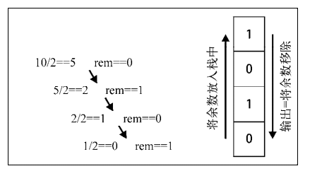

我们虽然可以在数组的任意位置上删除或者添加元素，然而，有时我们还需要一种在添加或删除元素时有更多控制的数据结构。

**栈**和**队列**类似于数组，但在添加和删除元素时更为可控。

# 栈

**后进先出**：新添加或待删除的元素都保存在栈的同一端（栈顶），另一端为栈底。

### 实现

* [JavaScript](./JavaScript/Stack.js)

### 栈的作用

用数组或链表实现功能不就好了，为什么还要栈呢？ 栈的引入简化了程序设计的问题，划分了不同关注层次。不用像数组一样花精力去关注数组下标增减等细节。

#### 十进制转二进制

以 `10 -> 1010` 为例:

* [JavaScript example](./JavaScript/example1.js)
